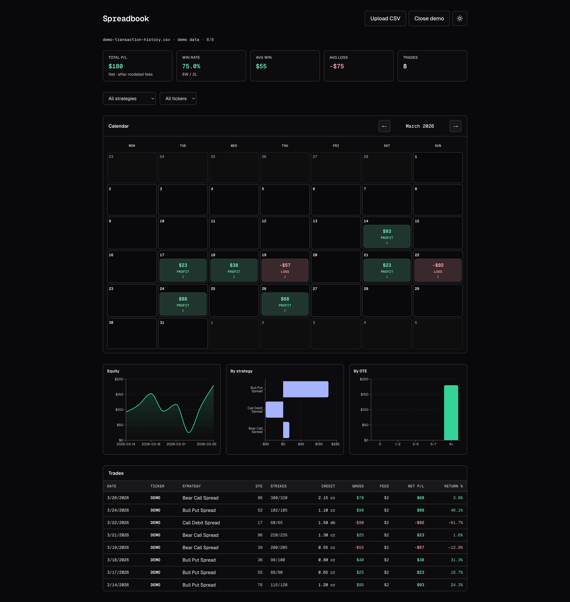

# Trade Logger

<p align="center">
  <a href="docs/screenshots/trade-logger.png" title="Open full-size screenshot">
    
  </a>
</p>

<p align="center"><em>One screen: KPIs, calendar, charts, and closed trades.</em></p>

> From messy tastytrade exports to **clear, actionable insight** — without extra friction loading.

**Trade Logger** is a lightweight **options** journal: upload a tastytrade export, and the app groups trades, calendar heatmaps, and charts. **Everything runs in the browser** — nothing is uploaded to a server. Use **Load demo** to try it without your own CSV.

---

## Getting started

```bash
cd tastytrade-journal
npm install
npm run dev
```

Open [http://localhost:3000](http://localhost:3000).

**Development:** `npm run dev` runs Express with Nodemon. When you edit UI or logic, Next applies **Fast Refresh** — you do not need to restart the whole server. Do a full restart only if you change `server.ts` or `next.config.ts`.

To **skip Express**, use `npm run dev:next` (Next CLI only).

**Production:** run `npm run build`, then `npm run start` (Express + production build). For `next start` only, use `npm run start:next`.

### Load demo (no broker export needed)

**Load demo** pulls the bundled sample file `public/samples/demo-transaction-history.csv` (fictitious **DEMO** ticker). Use it to explore the UI without logging in or exporting your account. You get the same flow if you choose **Upload CSV** and pick that file from disk.

---

## What gets saved in the browser

The last file name and trades are stored in **localStorage** under `trade-logger-journal-v1`. The legacy key `spreadbook-journal-v1` is still read once so nothing is lost after the rename; the next save writes the new key and drops the old one.

While a **demo** session is open, **Load demo** is hidden; **Close demo** exits the demo. After you load your own CSV, **Load demo** shows again, and the right-hand button reads **Clear saved** (clears storage and filters).

---

## CSV exports: two shapes

The format is inferred from the header row.

### Transaction history (recommended)

Best when the file includes real **fees** and **Total** columns.

Rows usually include `Date`, `Type`, `Sub Type`, `Value`, `Commissions`, `Fees`, `Total`, `Order #`, `Underlying Symbol`, expiration, strike, and `Call or Put`.

- **Same Order #** = one fill; multi-leg orders are summed into one bundle.
- Opens: *Sell to Open* / *Buy to Open*. Closes: *Sell to Close* / *Buy to Close*.
- **Net P/L** comes from `Total` (open + close), including broker-reported premium, commissions, and fees.
- **Gross** view = `Value` totals (premium side, broker sign convention).

### Activity (legacy export)

Familiar columns: `Symbol`, `Status`, `MarketOrFill`, `Time`, `Order #`, `Description`, with STO/BTO/STC/BTC legs in the description.

- **Same Order #** merges rows into one event.
- Per-row fees are usually missing, so the app uses a **`feePerContractRT`** model (one estimated round-trip fee per trade). Transaction history ignores that model.

---

## `DEFAULT_CFG` settings

File: `src/components/JournalApp.tsx`.

| Field | Purpose |
|--------|---------|
| `defaultYear` | Year fallback when exports only carry `YY` in some dates |
| `exportFallback` | Calendar anchor when activity CSV only has a time-of-day |
| `feePerContractRT` | Modeled fees — **activity CSV only** |

---

## Stack

Next.js 16, React 19, TypeScript, Tailwind v4, Recharts, next-themes.
